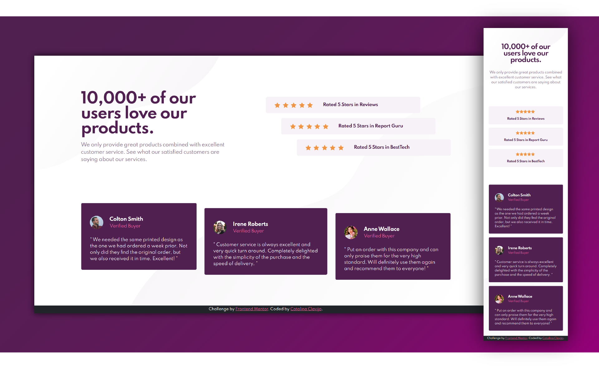

# Frontend Mentor - Social proof section
## HTML - CSS - Bootstrap / Responsive

This is a solution to the [Social proof section challenge on Frontend Mentor](https://www.frontendmentor.io/challenges/social-proof-section-6e0qTv_bA).

## Screenshot

### Links

- Live Site URL: [https://cataclas.github.io/Frontend-Mentor_Social-proof-section/](https://cataclas.github.io/Frontend-Mentor_Social-proof-section/)

## Built with

- Semantic HTML5 markup
- [CSS custom properties](https://devdocs.io/css/)
- [Bootstrap v5.0](https://getbootstrap.com/docs/5.0/getting-started/introduction/)
- Flexbox
- Responsive

## Author

- Frontend Mentor - [@Cataclas](https://www.frontendmentor.io/profile/Cataclas)
- GitHub - [Cataclas](https://github.com/Cataclas)
