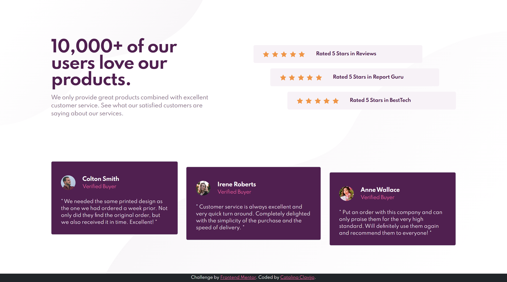
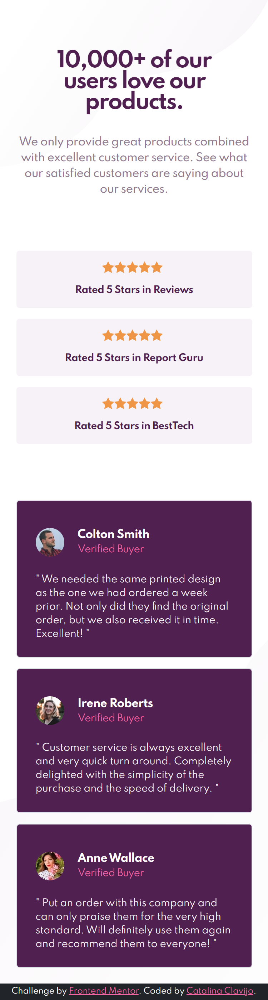

# Frontend-Mentor_Social-proof-section
# Frontend Mentor - Social proof section solution (HTML - CSS - Bootstrap Responsive)  This is a solution to the [Social proof section challenge on Frontend Mentor](https://www.frontendmentor.io/challenges/social-proof-section-6e0qTv_bA).   ### Screenshot       ### Links  - Solution URL: [Add solution URL here](https://your-solution-url.com) - Live Site URL: [Add live site URL here](https://your-live-site-url.com)   ## Built with  - Semantic HTML5 markup - [CSS custom properties](https://devdocs.io/css/) - [Bootstrap v5.0](https://getbootstrap.com/docs/5.0/getting-started/introduction/) - Flexbox - Responsive   ## Author  - Frontend Mentor - [@Cataclas](https://www.frontendmentor.io/profile/Cataclas) - GitHub - [Cataclas](https://github.com/Cataclas)
